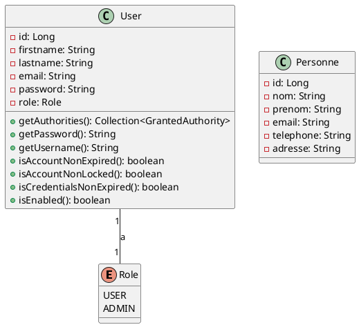

# Diagramme de Classes - ParcInfo

## Entités principales

### User
- **Attributs**:
  - id: Long (PK)
  - firstname: String
  - lastname: String
  - email: String (unique)
  - password: String (encrypted)
  - role: Role (enum)
- **Relations**:
  - Aucune relation directe avec d'autres entités

### Role (Enum)
- **Valeurs**:
  - USER
  - ADMIN

### Personne
- **Attributs**:
  - id: Long (PK)
  - nom: String
  - prenom: String
  - email: String
  - telephone: String
  - adresse: String
- **Relations**:
  - Aucune relation directe avec d'autres entités

## Diagramme au format PlantUML

## Notes
- Le système utilise Spring Security pour l'authentification et l'autorisation
- Les mots de passe sont chiffrés avec BCrypt
- L'authentification se fait via JWT (JSON Web Token)
- Les utilisateurs peuvent avoir deux rôles: USER ou ADMIN 